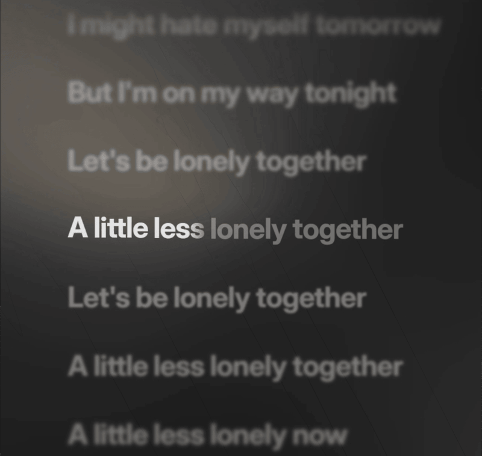
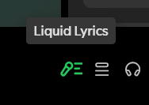

# Liquid Lyrics

A Spicetify extension that brings an Apple Music-inspired lyrics view into Spotify's main panel with word-by-word highlighting and a dynamic animated background.


## Preview



Full-screen and Now Playing views are coming soon, with more on the way.
## Requirements

- [Spotify desktop with Spicetify installed](https://spicetify.app/docs/getting-started)
- Node.js, if you're building from source

## Installation

### Spicetify Marketplace

Open [Marketplace](https://github.com/spicetify/marketplace) in Spotify, search for **Liquid Lyrics**, and click **Install**.

### GitHub Release

Download `liquid-lyrics.js` from the [latest release](https://github.com/abirwalker/liquid-lyrics/releases/latest) and place it in your Extensions folder:

| Platform | Extensions folder |
| --- | --- |
| Windows | `%appdata%\spicetify\Extensions\` |
| Linux / macOS | `~/.config/spicetify/Extensions/` |

Then run:

```sh
spicetify config extensions liquid-lyrics.js
spicetify apply
```

### Build from source

```sh
git clone https://github.com/abirwalker/liquid-lyrics.git
cd liquid-lyrics
npm ci
npm run build
```

The build creates `dist/liquid-lyrics.js`. If it hasn't already been copied into your Extensions folder, copy it to the path above, then run the two `spicetify` commands above.

## Using it

The Liquid Lyrics icon takes the place of Spotify's usual lyrics button in the player controls. Click it to open the lyric view, or press `Ctrl+Alt+L` (`Cmd+Alt+L` on macOS). Press `Escape` to return to Spotify.



## Where lyrics come from

Liquid Lyrics checks BiniLyrics and LyricsPlus first. If neither returns synced lyrics, it tries Spotify, AMLL, and LRCLIB. Word timing takes priority over line timing, with plain text as the last resort. Availability depends on the recording, so some songs won't have word-by-word highlighting.

## Credits

The lyric player and animated background use [AMLL Core](https://github.com/amll-dev/applemusic-like-lyrics). Thanks to [Binimum](https://github.com/binimum) for running the [BiniLyrics](https://lyrics-api.binimum.org) and [LyricsPlus](https://lyricsplus.binimum.org) servers used here. LyricsPlus is [ibratabian17's project](https://github.com/ibratabian17/lyricsplus). Spotify, [AMLL](https://github.com/amll-dev), and [LRCLIB](https://lrclib.net) provide the other lyric fallbacks.
